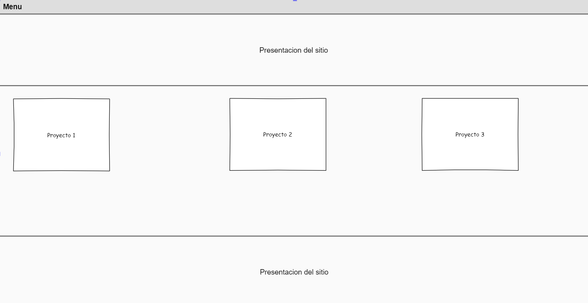
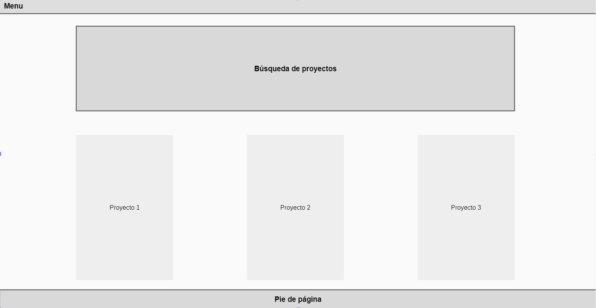

# Diseño

## Modelo conceptual

## Diseño de la interfaz de usuarios

**Vista de la página de inicio del sitio**

**Vista de un proyecto**

**Vista de contacto del sitio**

**Vista del perfil del usuario**

**Vista de todos los proyectos del sitio**

**Vista de registro e inicio de sesión**

**Vista de la lista de comentarios y noticias de un proyecto**

**Vista principal de un comentario o noticia**

**Vista de los enlaces externos de un proyecto**

## Caso de uso

## Diagrama de Base de Datos
