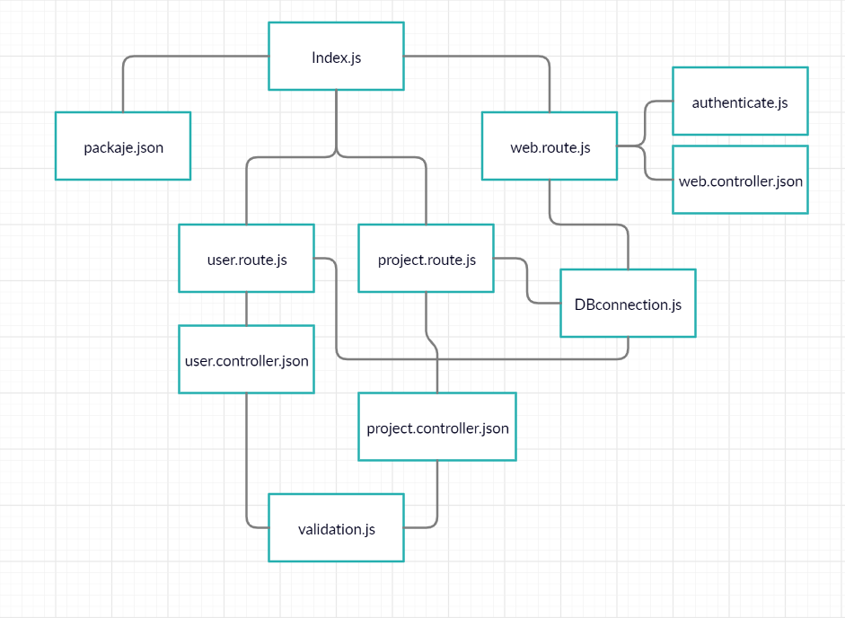
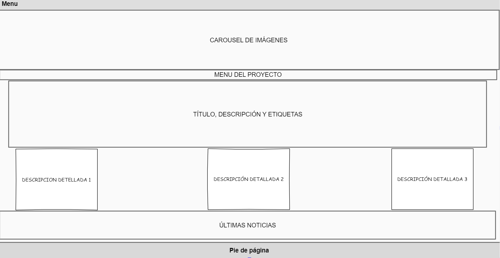
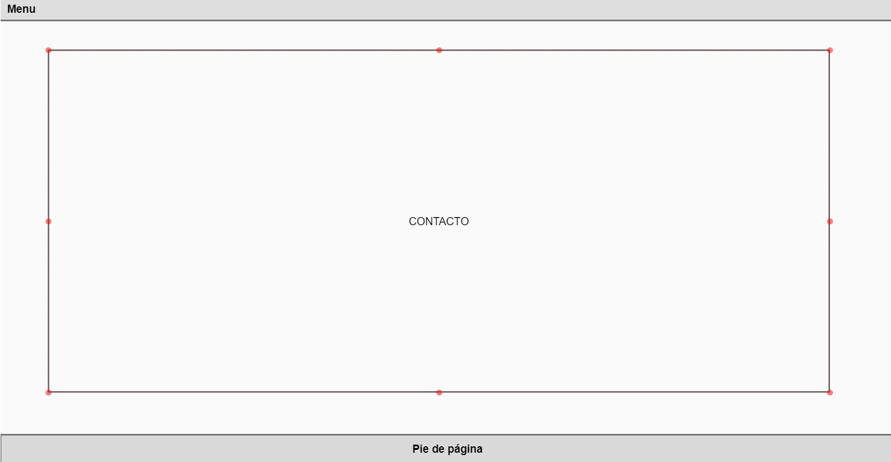
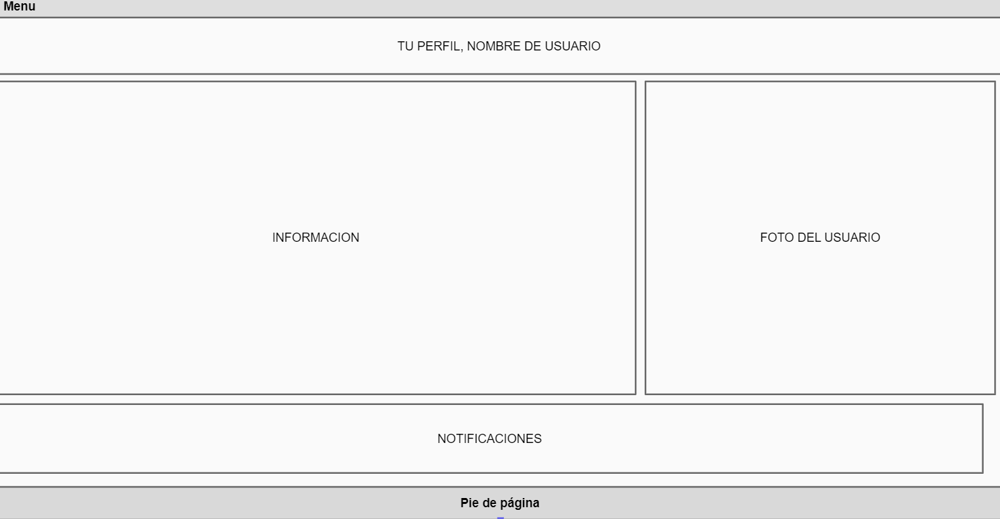
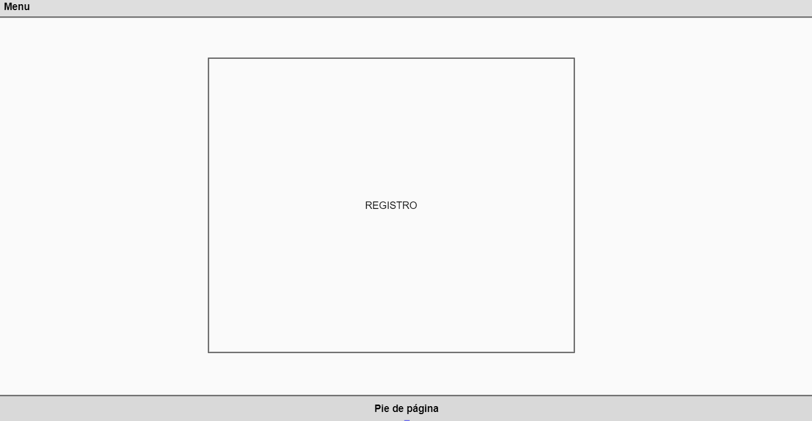
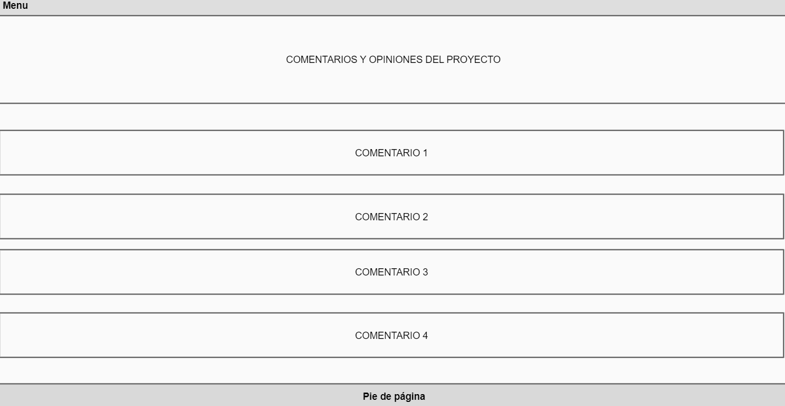
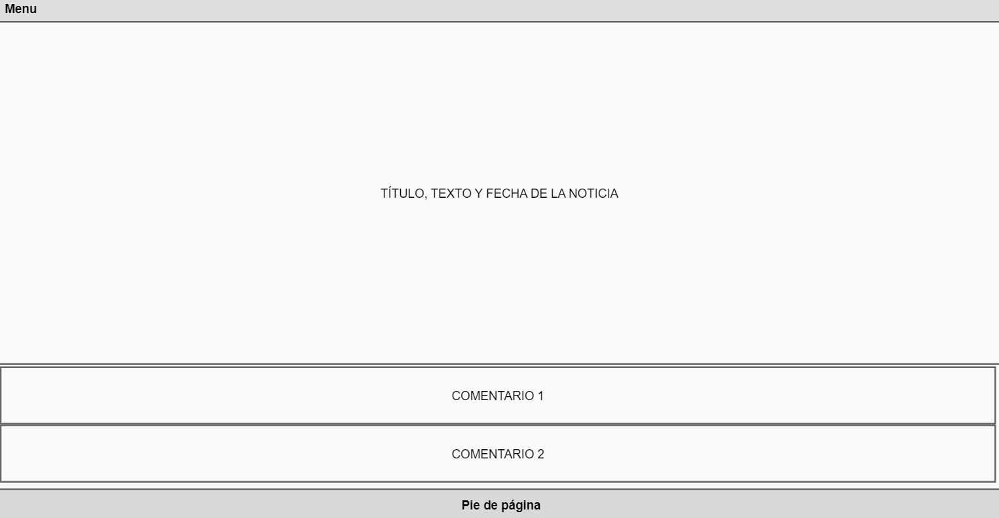
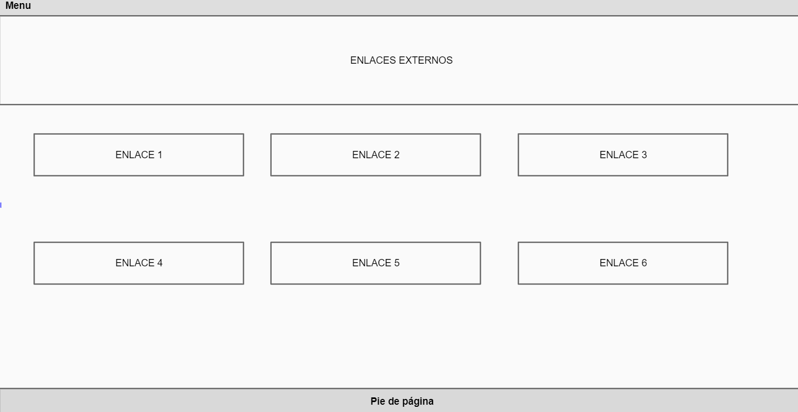
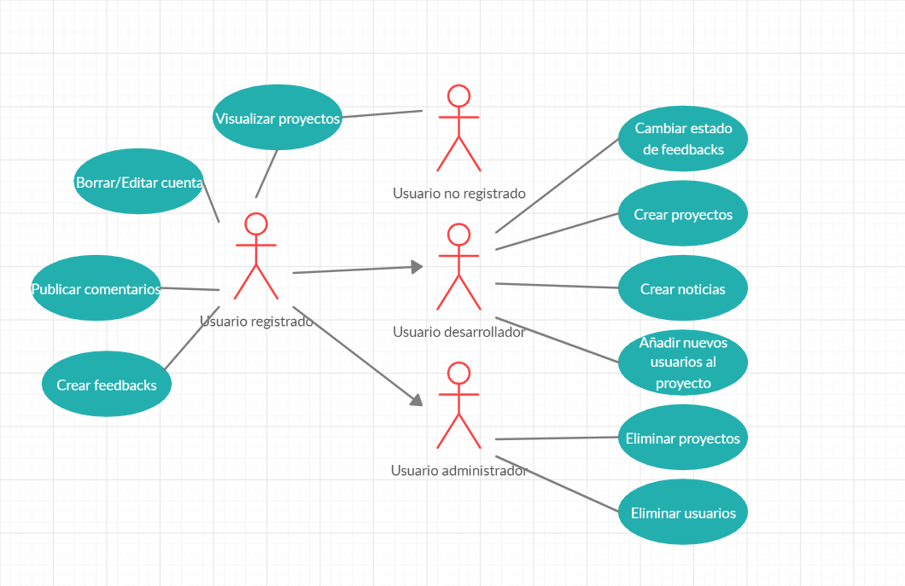
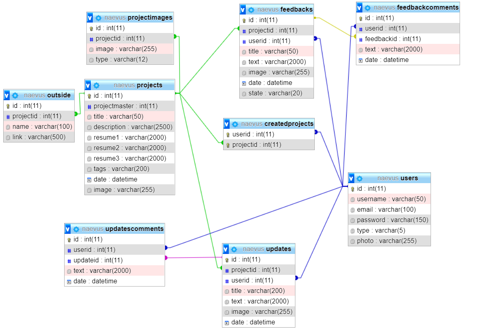

# Diseño

## Modelo conceptual

## Diseño de la interfaz de usuarios
*Vista de la página de inicio del sitio*

*Vista de un proyecto*

*Vista de contacto del sitio*

*Vista del perfil del usuario*

*Vista de todos los proyectos del sitio*

*Vista de registro e inicio de sesión*

*Vista de la lista de comentarios y noticias de un proyecto*

*Vista principal de un comentario o noticia*

*Vista de los enlaces externos de un proyecto*

## Caso de uso

## Diagrama de Base de Datos
